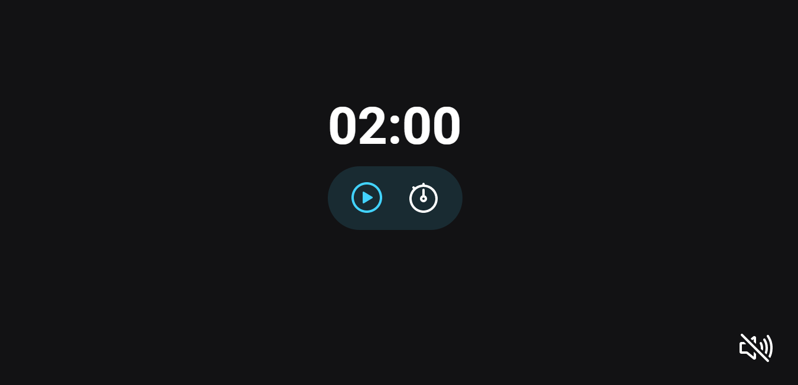
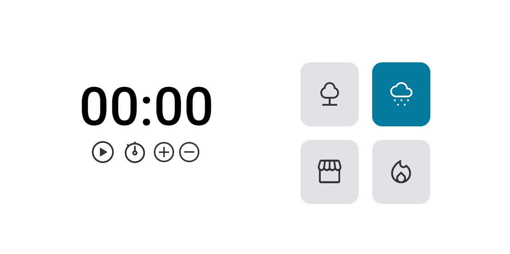
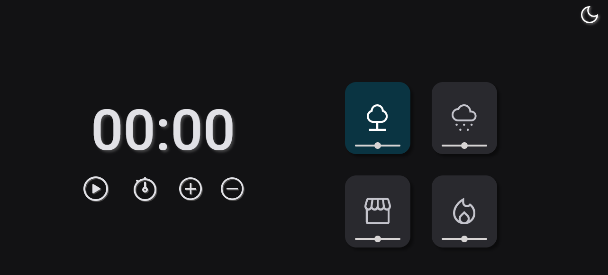

# Projeto 09 | Programa Explorer da Rocketseat

 

> ## 👩🏻‍💻 Desafio 1️⃣ : criar um temporizador (FocusTimer). 
 

 

> ## 👩🏻‍💻 Desafio 2️⃣ : criar um temporizador (FocusTimer - Versão 2). 
 

- Cada card quando selecionado, vai mudar de cor e emitir um som diferente 
    1) Floresta
    2) Chuva
    3) Cafeteria
    4) Lareira 
- Funcionalidades esperadas dos botões:
    1) Play: aciona o timer;
    2) Stop: para o timer;
    3) ( + ): aumenta em mais 5 minutos o tempo do timer;
    4) ( - ): diminui em 5 minutos o tempo do timer. 

 

> ## 👩🏻‍💻 Desafio 3️⃣ : criar um temporizador (FocusTimer - Dark Mode).
 

🔗[Clique aqui para acessar](https://alineviana.github.io/contador/FocusTimer-DarkMode/)

- Criar a versão Dark Mode.
- Trabalhar com o volume dos sons de cada card.
- Funcionalidade de um card: quando selecionado ele muda de cor e começa a tocar o som específico.
- Nessa versão, o volume deverá ser controlado pelo slider que está embaixo de cada ícone.
- Por padrão, quando clicar em qualquer área de um card, pode deixar o volume em 50%.

 

> ## 📝 Conceitos estudados
 

- Estrutura HTML do FocusTimer
- Estilos do app FocusTimer
- Ajustando larguras e tamanhos com CSS clamp
- Alinhando com grid 
- DOM 
- Event-driven, programação imperativa e callbacks
- Refatoração
- Princípios de Clean Code e programação declarativa
- Escopos
- Introdução ao ES6 Modules
- Modularização 
- Criação de objetos com o padrão Factory e injeção de dependências
- Adição de sons
- Resolução de bugs 

 

> ## 🖥️ Tecnologias

 

- HTML5  
- CSS3
- JavaScript

 

